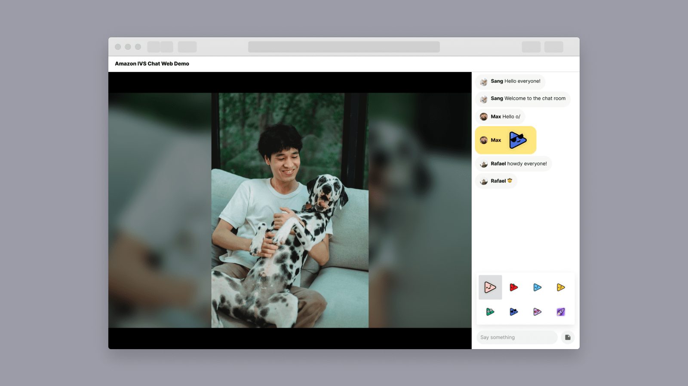

# Amazon IVS Chat Web Demo

A demo web application intended as an educational tool to demonstrate how you can build a simple live video and chat application with [Amazon IVS](https://aws.amazon.com/ivs/).

**This project is intended for education purposes only and not for production usage.**

This is a serverless web application, leveraging [Amazon IVS](https://aws.amazon.com/ivs/) for video streaming and chat, [AWS Lambda](https://aws.amazon.com/lambda/), and [Amazon API Gateway](https://aws.amazon.com/api-gateway/). The web user interface is written in Javascript and built on React.

The demo showcases how you can implement a simple live streaming application with video and chat using Amazon IVS. Viewers are asked to enter their name the first time they begin chatting. Chat users can send plain text messages, text links, emojis, and stickers. Chat moderators can delete messages and kick users.

## Getting Started

This demo is comprised of two parts: `serverless` (the demo backend) and `web-ui` (the demo frontend).

1. If you do not have an AWS account, you can create one by following this guide: [How do I create and activate a new Amazon Web Services account?](https://aws.amazon.com/premiumsupport/knowledge-center/create-and-activate-aws-account/)
2. Log into the [AWS console](https://console.aws.amazon.com/) if you are not already. Note: If you are logged in as an IAM user, ensure your account has permissions to create and manage the necessary resources and components for this application.
3. Deploy the [serverless backend](./serverless/README.md) to your AWS account. The CloudFormation template will automate the deployment process.

## Known issues and limitations

* The application is meant for demonstration purposes and **not** for production use.
* This application is only tested in the us-west-2 (Oregon) region. Additional regions may be supported depending on service availability.

## About Amazon IVS
Amazon Interactive Video Service (Amazon IVS) is a managed live streaming and stream chat solution that is quick and easy to set up, and ideal for creating interactive video experiences. [Learn more](https://aws.amazon.com/ivs/).

* [Amazon IVS docs](https://docs.aws.amazon.com/ivs/)
* [User Guide](https://docs.aws.amazon.com/ivs/latest/userguide/)
* [API Reference](https://docs.aws.amazon.com/ivs/latest/APIReference/)
* [Setting Up for Streaming with Amazon Interactive Video Service](https://aws.amazon.com/blogs/media/setting-up-for-streaming-with-amazon-ivs/)
* [Learn more about Amazon IVS on IVS.rocks](https://ivs.rocks/)
* [View more demos like this](https://ivs.rocks/examples)

## Security

See [CONTRIBUTING](CONTRIBUTING.md#security-issue-notifications) for more information.

## License

This library is licensed under the MIT-0 License. See the LICENSE file.