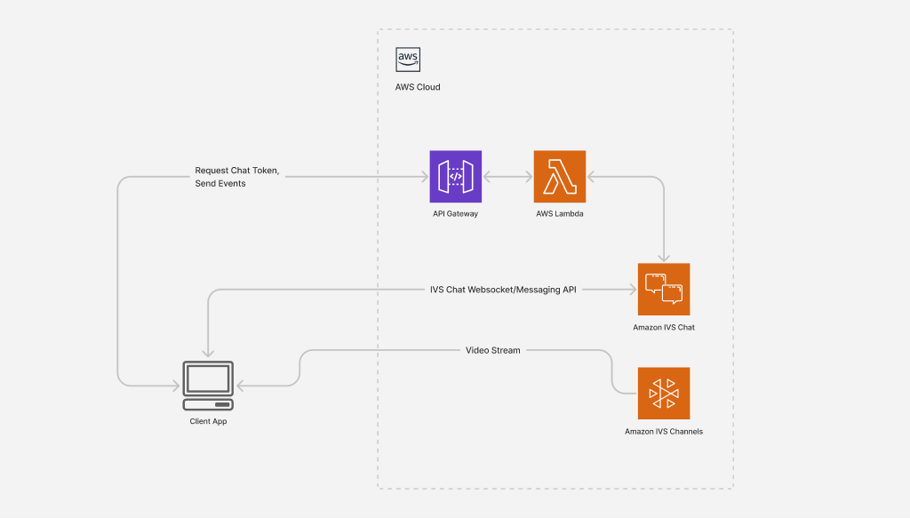

# Amazon IVS Chat Demo Backend

This readme includes instructions for deploying the Amazon IVS Chat Demo backend to an AWS Account. This backend supports the following Amazon IVS Chat Demos:

* [Amazon IVS Chat Web Demo](https://github.com/aws-samples/amazon-ivs-chat-web-demo)
* [Amazon IVS Chat iOS Demo](https://github.com/aws-samples/amazon-ivs-chat-for-ios-demo)
* [Amazon IVS Chat Android Demo](https://github.com/aws-samples/amazon-ivs-chat-for-android-demo)

## Application overview



The chat demo backend emits event messages and handles encrypted chat tokens, which authorize users to perform actions in your chat room. In this demo, the backend simply accepts whatever information the client provides. When you launch the client app, you’ll be able to pick a username, profile picture, and whether or not you want moderator permissions. In a production setting, the backend application would likely interface with your existing user service to determine the capabilities to grant a client. For example, a client that is marked as a default user in your user database might only be authorized view and send messages, but a client marked as a moderator could also be authorized to delete messages and disconnect users.

## Prerequisites

* [AWS CLI Version 2](https://docs.aws.amazon.com/cli/latest/userguide/install-cliv2.html)
* [AWS SAM CLI](https://docs.aws.amazon.com/serverless-application-model/latest/developerguide/what-is-sam.html)
* Access to an AWS Account with at least the following permissions:
  * Create IAM roles
  * Create Lambda Functions
  * Authenticate and send Events in Amazon IVS Chat
  * Create Amazon S3 Buckets

***IMPORTANT NOTE:** Running this demo application in your AWS account will create and consume AWS resources, which will cost money.* Amazon IVS is eligible for the AWS free tier. Visit the Amazon IVS [pricing page](https://aws.amazon.com/ivs/pricing/) for more details.

## Run this app locally

Before you start, run the following command to make sure you're in the correct AWS account (or configure as needed):

```bash
aws configure
```

### 1. Install AWS SDK

Navigate to `serverless/dependencies/nodejs` and run `npm install` to install the AWS SDK.

### 2. Start the local api

Navigate back to the `serverless` directory and run the following command:

```bash
sam local start-api -p 3100
```

For a full list of command flags, refer to the [SAM CLI documentation](https://docs.aws.amazon.com/serverless-application-model/latest/developerguide/sam-cli-command-reference-sam-local-start-api.html)


## Deployment instructions

Before you start, run the following command to make sure you're in the correct AWS account (or configure as needed):

```bash
aws configure
```

For configuration specifics, refer to the [AWS CLI User Guide](https://docs.aws.amazon.com/cli/latest/userguide/cli-chap-configure.html)

### 1. Install AWS SDK

Navigate to `serverless/dependencies/nodejs` and run `npm install` to install the AWS SDK.

### 2. Create an S3 bucket

* Replace `<S3_BUCKET>` with a name for your S3 Bucket.
* Replace `<AWS_REGION>` with your AWS region. The following regions are currently supported:
  * us-east-1
  * us-west-2
  * eu-east-1

```bash
aws s3api create-bucket --bucket <S3_BUCKET> --region <AWS_REGION> \
--create-bucket-configuration LocationConstraint=<AWS_REGION>
```

### 3. Pack template with SAM

```bash
sam package --template-file template.yaml \
  --s3-bucket <S3_BUCKET> \
  --output-template-file output.yaml
```

DO NOT run the output from above command, proceed to next step.

### 4. Deploy the packaged template

* Replace `<STACK_NAME>` with a name of your choice. The stack name will be used to reference the application.
* Replace `<AWS_REGION>` with the AWS region you entered in Step 1.

```bash
sam deploy --template-file ./output.yaml \
--stack-name <STACK_NAME> \
--capabilities CAPABILITY_IAM \
--region <AWS_REGION>
```

### Use your deployed backend in the client applications

When the deployment successfully completes, copy the output `ApiURL` for use in the various client application demos:

* [Amazon IVS Chat Web Demo](https://github.com/aws-samples/amazon-ivs-chat-web-demo)
* [Amazon IVS Chat iOS Demo](https://github.com/aws-samples/amazon-ivs-chat-for-ios-demo)
* [Amazon IVS Chat Android Demo](https://github.com/aws-samples/amazon-ivs-chat-for-android-demo)

### Accessing the deployed application

If needed, you can retrieve the Cloudformation stack outputs by running the following command:

* Replace `<STACK_NAME>` with the name of your stack from Step 3.

```bash
aws cloudformation describe-stacks --stack-name <STACK_NAME> \
--query 'Stacks[].Outputs'
```

## Cleanup

To delete the deployed application, you can use the AWS CLI. You can also visit the [AWS Cloudformation Console](https://us-west-2.console.aws.amazon.com/cloudformation/home) to manage your application.

Delete Cloudformation stack:

```bash
aws cloudformation delete-stack --stack-name <STACK_NAME>
```

Remove files in S3 bucket

```bash
aws s3 rm s3://<S3_BUCKET> --recursive
```

Delete S3 bucket

```bash
aws s3api delete-bucket --bucket <S3_BUCKET> --region <AWS_REGION>
```

## Resources

For an introduction to the AWS SAM specification, the AWS SAM CLI, and serverless application concepts, see the [AWS SAM Developer Guide](https://docs.aws.amazon.com/serverless-application-model/latest/developerguide/what-is-sam.html).

Next, you can use the AWS Serverless Application Repository to deploy ready-to-use apps that go beyond Hello World samples and learn how authors developed their applications. For more information, see the [AWS Serverless Application Repository main page](https://aws.amazon.com/serverless/serverlessrepo/) and the [AWS Serverless Application Repository Developer Guide](https://docs.aws.amazon.com/serverlessrepo/latest/devguide/what-is-serverlessrepo.html).
